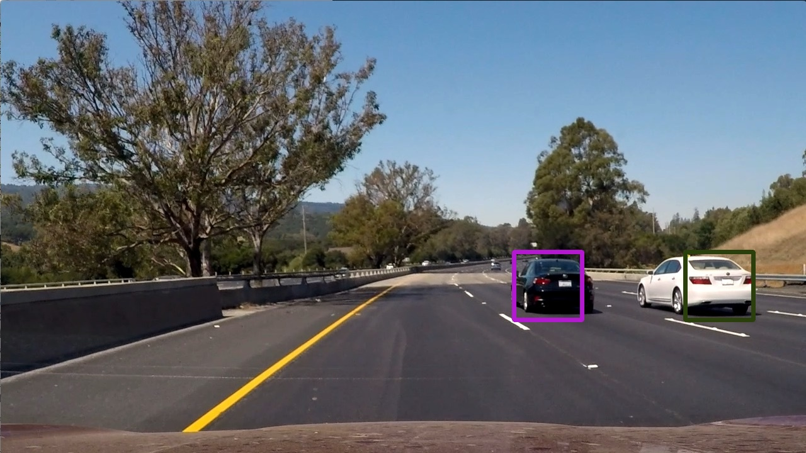
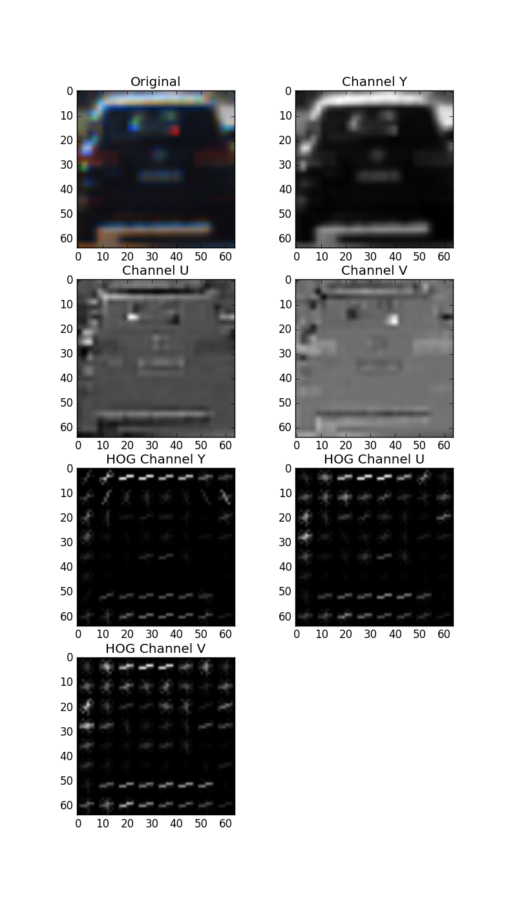
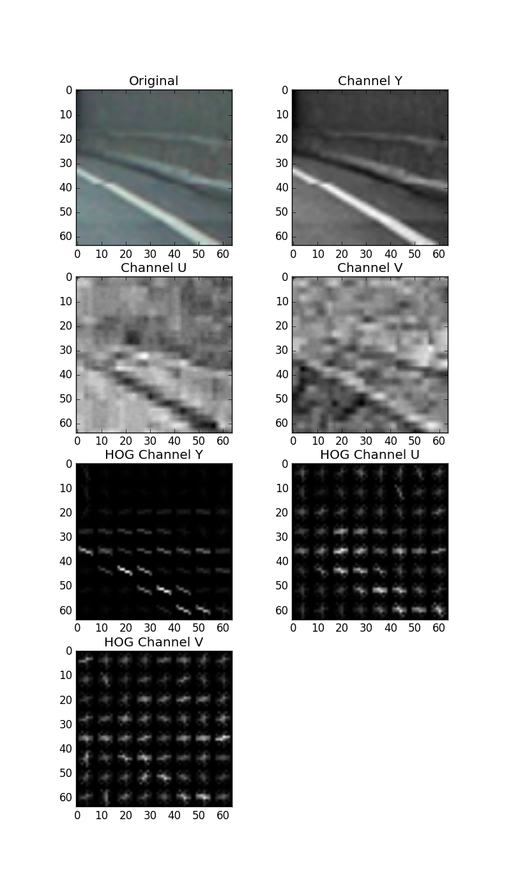
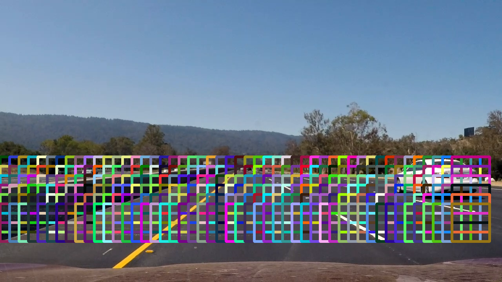
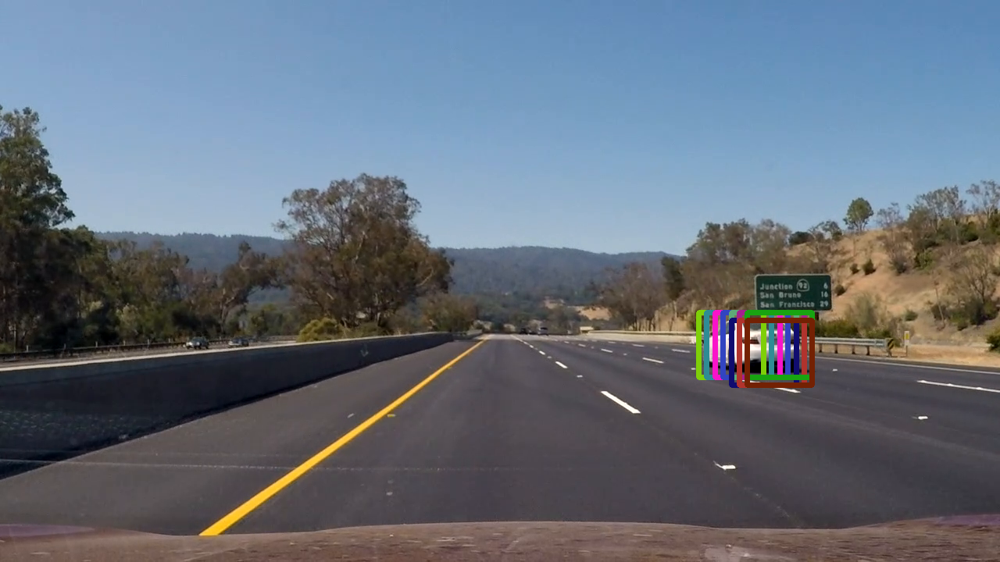

# Vehicle Detection

The goal of this project is to detect and track cars in a video file using a trained classifier, as illustrated in the
frame below:

The classifier used in this project is trained with labeled images of cars and non-car (e.g. road, roadside).
Each image has size 64 x 64 and the dataset contains 8792 car images and 8968 non-car images.

The method implemented in this project uses a Linear Support Vector classifier with Histogram of Oriented Gradients (HOG) 
as features.

## Histogram of Oriented Gradients (HOG)
HOG features present the occurrences of gradient orientation in parts of the image for a given channel. The images below
illustrate HOG features of a car image and a non-car image.

* Sample HOG from a car image in YUV channels: 

* Sample HOG from a non-car image in YUV channels:

The HOG feature extraction is configured with the following parameters:
* Orientations: number of different orientations tracked by the features (bins).
* Pixels per cell: size of a cell.
* Cells per block: number of cells in each block.
* Color Space and Channels: color space to use for extracting HOG features and which channels. 
 
After experimenting with different combinations of parameters I decided for 9 orientations (bins), 8 pixels per cell, 
2 cells per block and YUV space and all 3 channels. This decision was based on evaluating the performance of the 
classifier in the test dataset, with ~ 98% correct predictions.

## Training the Classifier
The classifier used in this project is implemented in VehicleClassifier.py. The training step is implemented in the 
method train and it saves the result for future reuse in a pickle "classifier.p", avoiding training the classifier 
again during each run. The classifier scales the features to zero mean and unit variance using 
sklearn.preprocessing.StandarScaler.

## Sliding Window Search
Once the classifier is trained we can proceed to detect cars in video streams. The classifier however is trained to
detect cars in images with size 64x64, so we need to implement a window search that slides through the video frame
 searching for cars. The window search is implemented in the method find_cars in VehicleClassifier. The figure below
 shows an example of windows searched for cars in a given video frame:

As can be observed from the figure above only a certain region of interest is searched within the image. The
parameter scale in VehicleClassifier::find_cars determine the size of the window searched.

The pipeline in VehicleDetectionPipeline::process_frame uses multiple window sizes for different y regions of
the image. The following scales were used: 1.2, 1.3 and 1.4.
 
## Implementation Details
All the windows identified as potential cars are added together into a heatmap. This heatmap is then thresholded to keep
only regions with high confidence that there are cars, as multiple windows in the sliding search would overlap, identifying
the same car several times.
 
 

To reduce further the occurrence of false positives I used 2 thresholds:
* Threshold Low: used for identifying the bounding box of the car.
* Threshold High: used for filtering only boxes that have high count in the heatmap.

The thresholds above can be seen the following way: the threshold high tells if a set of boxes is a car, and the threshold
 low gives the bounding box size.

I also added a prune based on the area of the detected boxes based on the max y-coordinate of the box, pruning boxes
 that are too small for appearing in a given region of the image. 
 
 The methods above are implemented in VehicleDetectionPipeline::prune_labels.

## Conclusion and Discussion
This project required a lot of experimentation with parameters, testing in the video pipeline and debugging images.
 It could be improved  to completely remove false positives by further tuning the parameters, including the 
 (scale, y-region) for searching with sliding windows. 
 The method implemented in this project would also have to be improved to support real-time frame processing.
 
 The result of the project can be seen in the link below:
 
 
 

